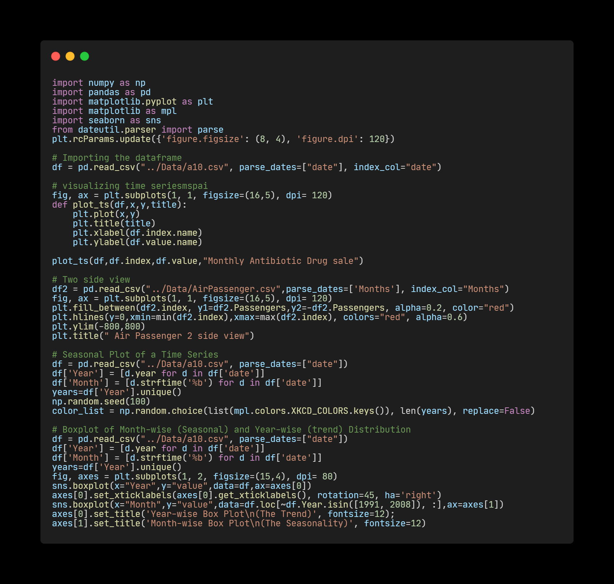
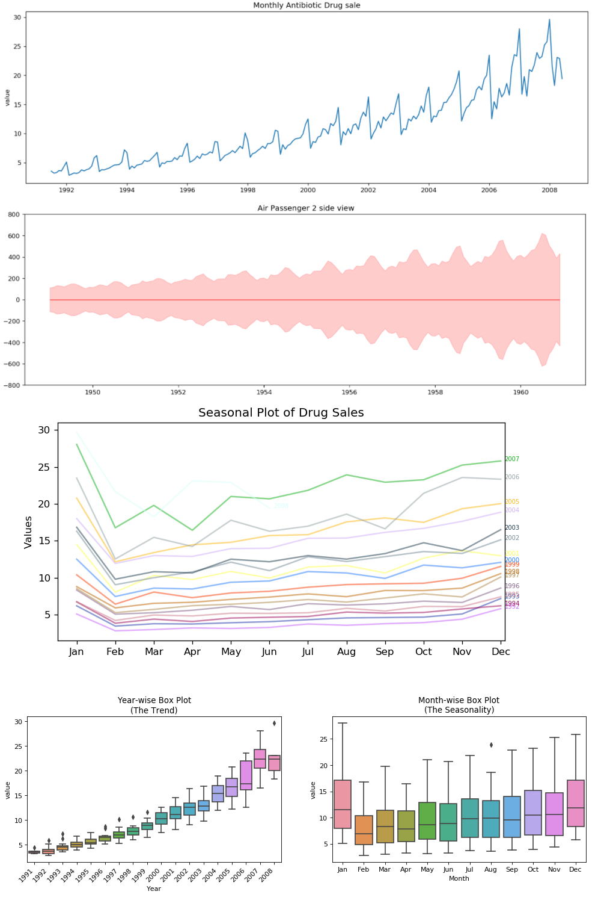
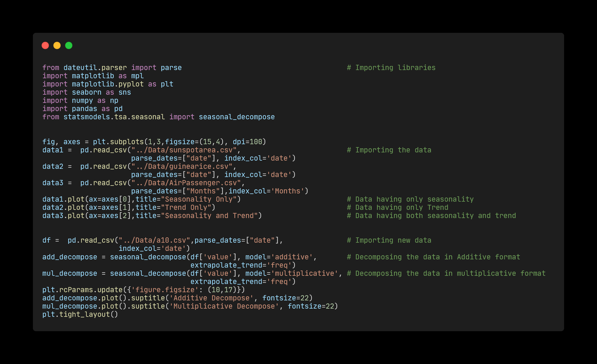
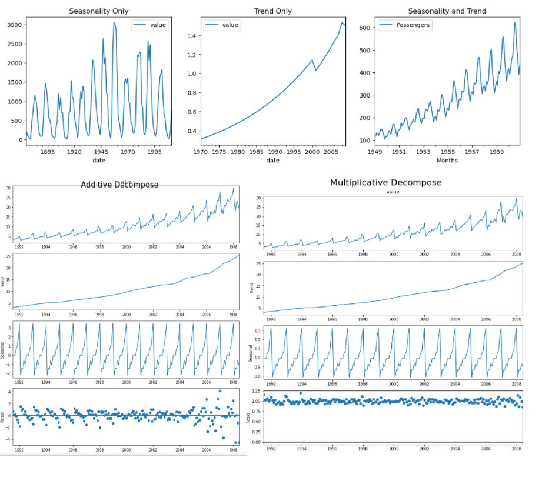

# TimeSeries_Analysis
---
## Day 1 :

Time series data, as the name indicates, differ from other types of data in the sense that the temporal aspect is an important area of machine learning and is often neglected. On a positive note, this gives us additional information that can be used when building our machine learning model, that not only the input features contain useful information, but also the changes in input/output over time. However, while the time component adds additional information, it also makes time series problems more difficult to handle compared to many other prediction tasks.

Analysts can tell the difference between random fluctuations or outliers, and can separate genuine insights from seasonal variations. Time series analysis shows how data changes over time, and good forecasting can identify the direction in which the data is changing.

 

---
## Day 2 : 

There are three types of time series patterns: trend, seasonal, and cyclic. A trend exists when there is a long-term increase or decrease in the data. It does not have to be linear. Sometimes we will refer to a trend as “changing direction,” when it might go from an increasing trend to a decreasing trend. A seasonal pattern occurs when a time series is affected by seasonal factors such as the time of the year or the day of the week. Seasonality is always of a fixed and known frequency.A cycle occurs when the data exhibit rises and falls that are not of a fixed frequency. These fluctuations are usually due to economic conditions, and are often related to the “business cycle.”

Time series decomposition involves thinking of a series as a combination of level, trend, seasonality, and noise components. Decomposition provides a useful abstract model for thinking about time series generally and for better understanding problems during time series analysis and forecasting. There are 2 types of decomposition "Additive Model" and "Multiplicative Model". 

Additive model: Level + Trend + Seasonality + Noise
Multiplicative model = Level * Trend * Seasonality * Noise

An additive model is linear where changes over time are consistently made by the same amount. A multiplicative model is nonlinear, such as quadratic or exponential. Changes increase or decrease over time.

 

